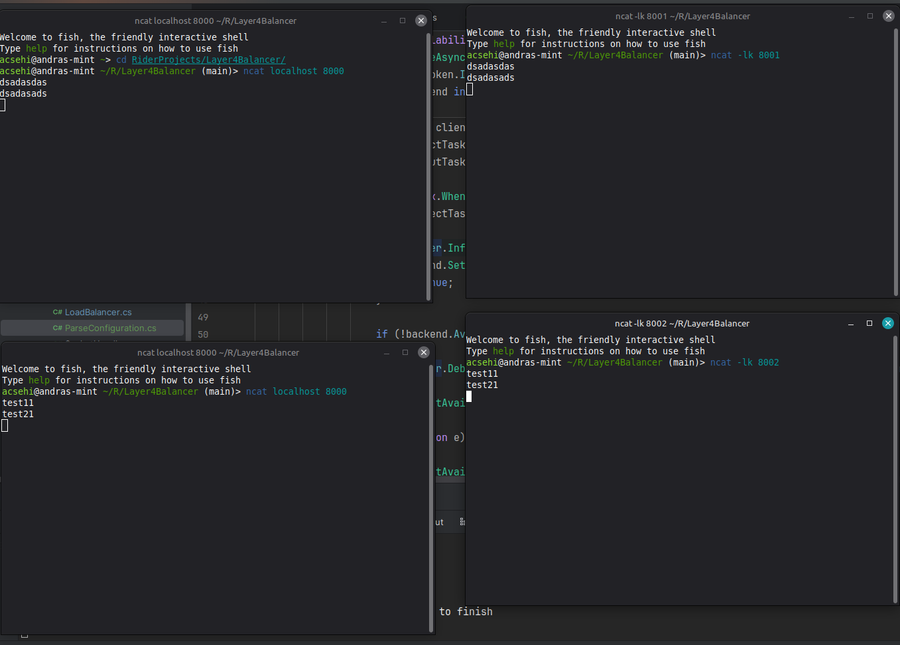

# TCP Load Balancer written in .NET

This is a light-weight load-balancer which is capable of directing traffic to multiple backends and continuously checks the availability of them.

## How does it work

1. When starts up, it checks all the configured backends for availability, and flags the ones which seems off-line.
1. The a listening process starts.
1. When a connection made, it tries to find a backend which has the least active connection.
1. Connects the two sockets together, and copies the traffic between them until the connection closes on the backend or on the client.

# How to run locally
## Requirements

* .NET8 Runtime

## To Build

```bash
git https://github.com/andras468/PayrocLayer4LoadBalancer
cd Layer4Balancer/
dotnet build
```

## To Configure

It can be configurable through environment variables.

| Variable                                    | Description                                                                                                         | Default value |
|:--------------------------------------------|:--------------------------------------------------------------------------------------------------------------------|:--------------|
| LB_BACKEND_LIST                             | List of the backend servers in the format: `ipaddress:port;ipaddress:port;...`                                      | None          |
| LB_LISTENING_PORT                           | The port where the load balancer listening on all available interfaces.                                             | 7000          |
| LB_AVAILABILITY_CHECK_INTERVAL_MS           | The delay between availability checks (milliseconds).                                                               | 5000          |
| LB_AVAILABILITY_CHECK_CONNECTION_TIMEOUT_MS | The timeout when the availability checking process trying to connect to a backend endpoint to determine the health. | 1000          |

## To Run

From the root folder of the repository
```bash
dotnet run --project src/Layer4Balancer/Layer4Balancer.csproj
```

# Simulate

## Backend(s)

```bash
ncat -lk {port}
```

## Client(s)

```bash
ncat {ipaddress} {listening port}
```

# Known bugs and limitations

* No limits on connections to backends.
* Only has one load balancing strategy.
* Only TCP protocol supported.

# Testing

## Testing strategy
* Unit tests
* Manual tested using `ncat` (Note: In a Linux environment do not use `netcat` it cannot accept multiple connections the same time.)

## Screenshot from manual testing

